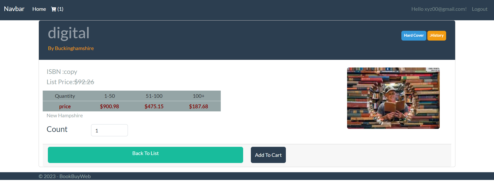
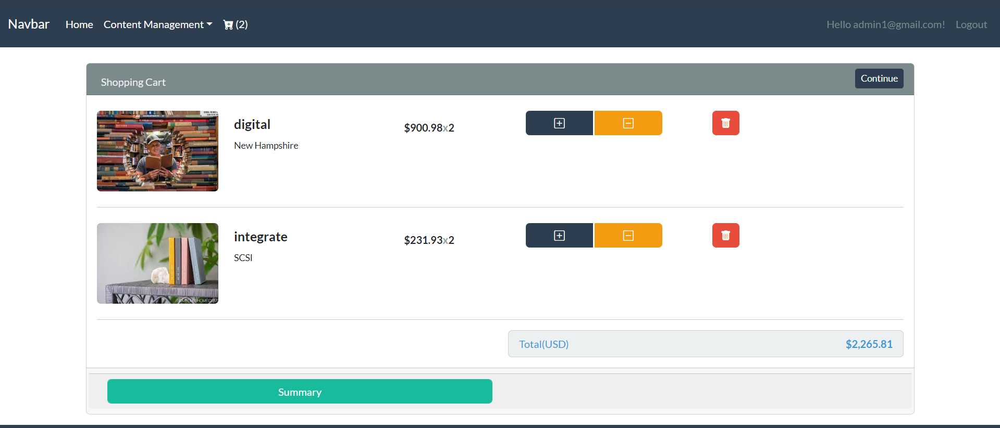
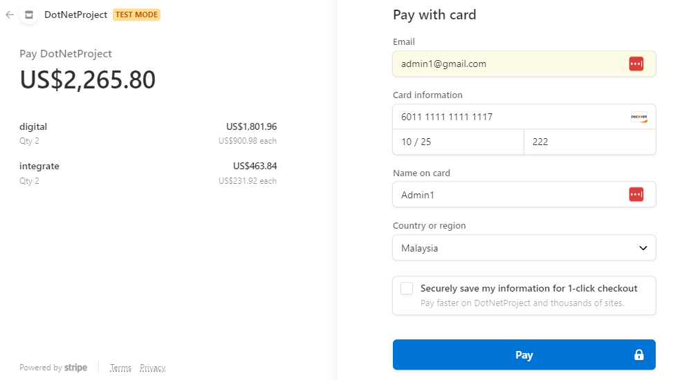
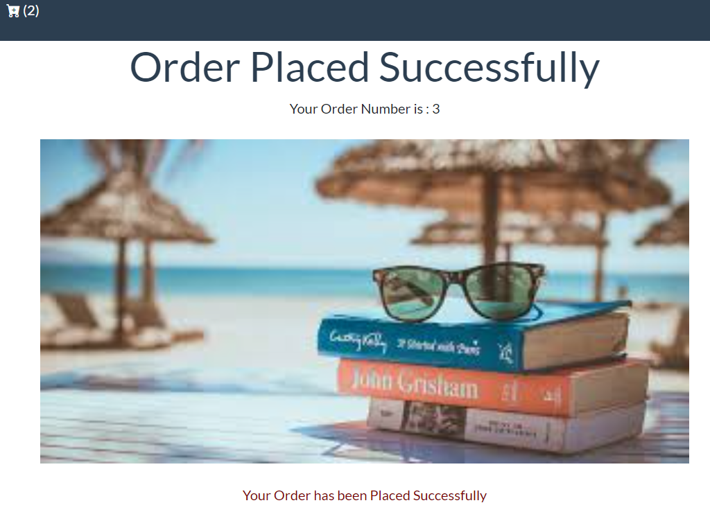

### BookBuy
This is a simple project for Book retail management
## Features:
	- Admin Can add new book into the system for selling
	- Buyers from Company/Invidual can order books and make payment(Stripe is used for payment)
	- Authentication and Authorization is implemented as well

## User Interfaces
### Add to Cart Page

### Order Page

### Stripe Payment

### Succesfully Order Place

